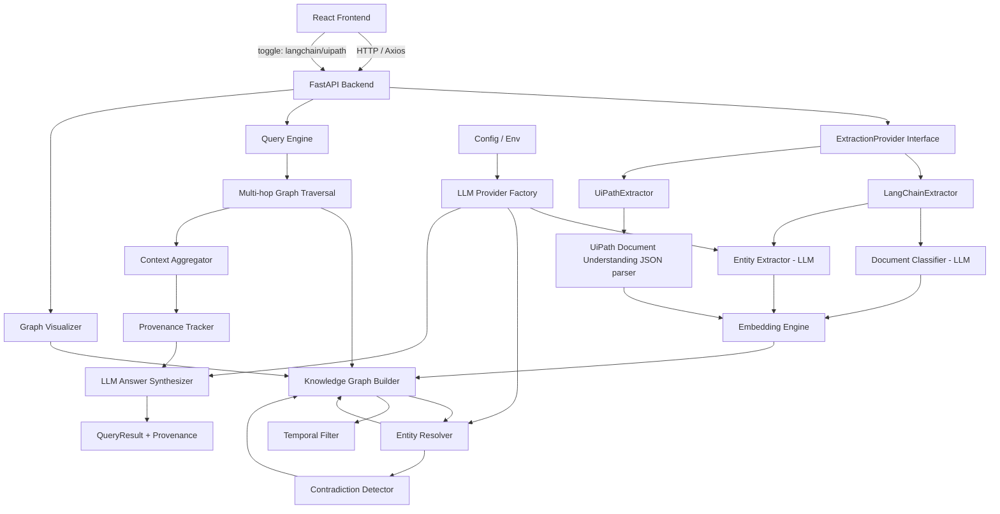
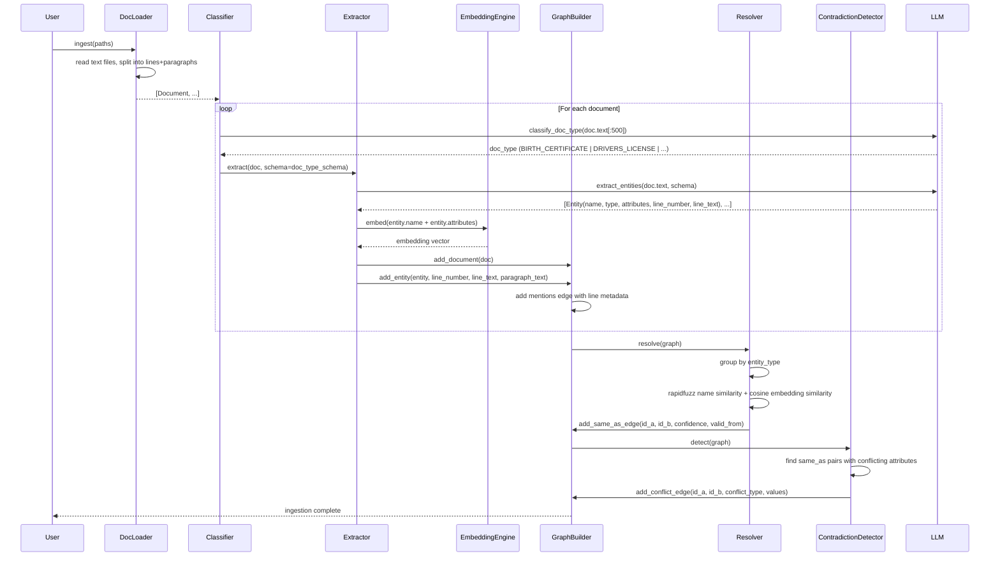
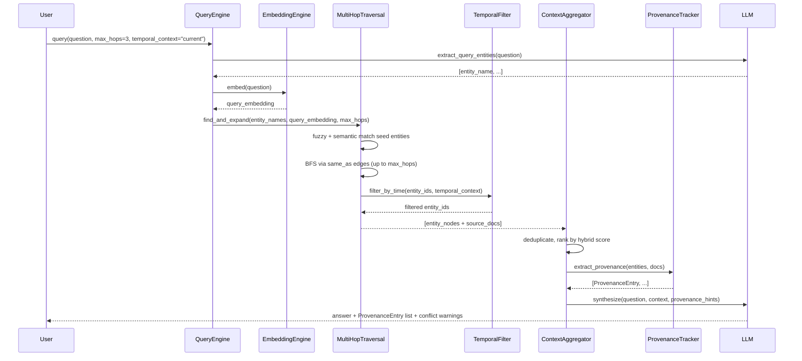

# Design Document: Graph RAG (Knowledge Graph-based Retrieval Augmented Generation)

## Overview

Graph RAG is an advanced retrieval-augmented generation system that builds a temporal, confidence-scored knowledge graph over ingested documents, enabling cross-document entity resolution, multi-hop reasoning, contradiction detection, and verifiable provenance linking.

Unlike standard RAG — which treats each document chunk independently and fails when the same entity appears across multiple documents — Graph RAG extracts named entities from every document, links co-referent entities via `same_as` edges, and uses graph traversal to retrieve and synthesize information spanning multiple documents. Every fact in an answer is traceable to the exact line and paragraph in the source document.

**Key capabilities:**
- **Cross-document entity resolution**: "John" in a birth certificate = "John" in a driver's license
- **Multi-hop reasoning**: traverse chains of 3+ documents to answer complex queries
- **Temporal awareness**: time-stamped edges resolve "current address" to the most recent document
- **Confidence scoring**: every resolution edge carries a 0.0–1.0 confidence score
- **Contradiction detection**: conflicting attribute values across same-person documents are surfaced automatically
- **Vector + Graph hybrid retrieval**: semantic embeddings + graph structure for best-of-both recall
- **Dual extraction engine**: LangChain (LLM-based) and UiPath Document Understanding, switchable via frontend toggle
- **Document type classification**: auto-detects birth certificates, licenses, passports, insurance records, medical records
- **Metadata tagging**: every entity records its source document, exact line number, verbatim text, and extraction model
- **Provenance / verify links**: every fact in the answer links to the exact line it was extracted from
- **Interactive graph visualization**: Pyvis-powered HTML graph with color-coded nodes and tooltips
- **React frontend**: full web UI with LangChain/UiPath toggle, document upload, query interface, and provenance display
- **FastAPI REST API + CLI**: query the pipeline via HTTP or command line

The system runs fully locally with Ollama (no API keys, no data leaves the machine) and is switchable to OpenAI for production via a single environment variable.

---

## Architecture



---

## Frontend Architecture (React + TypeScript)

### Component Tree

```
App
├── Header
│   └── ExtractionToggle        ← LangChain | UiPath switch
├── IngestPanel
│   ├── DocumentUpload          ← drag & drop .txt or UiPath JSON
│   ├── ExtractionModeInfo      ← shows active mode description
│   └── IngestButton
├── QueryPanel
│   ├── QueryInput              ← natural language question
│   ├── HopSlider               ← max_hops: 1–5
│   ├── TemporalSelect          ← current | all | specific date
│   └── QueryButton
├── ResultsPanel
│   ├── AnswerDisplay           ← answer text
│   ├── ProvenanceList          ← per-fact: filename + line number + verbatim line
│   ├── ConflictWarnings        ← highlighted conflict cards (critical=red, minor=yellow)
│   └── SourceDocuments         ← list of files used in answer
├── GraphPanel
│   ├── GraphVisualization      ← embedded Pyvis HTML iframe
│   └── GraphStats              ← node/edge counts, entity type breakdown
└── EntitiesPanel
    └── EntityTable             ← searchable table of all graph entities
```

### ExtractionToggle Component

```tsx
type ExtractionMode = 'langchain' | 'uipath';

const ExtractionToggle: React.FC = () => {
  const [mode, setMode] = useState<ExtractionMode>('langchain');

  return (
    <div className="extraction-toggle">
      <span>Extraction Engine:</span>
      <button
        className={mode === 'langchain' ? 'active' : ''}
        onClick={() => setMode('langchain')}
      >
        🔗 LangChain (LLM)
      </button>
      <button
        className={mode === 'uipath' ? 'active' : ''}
        onClick={() => setMode('uipath')}
      >
        🤖 UiPath Document Understanding
      </button>
      <ModeDescription mode={mode} />
    </div>
  );
};
```

**LangChain mode**: accepts raw `.txt` files → LLM classifies + extracts
**UiPath mode**: accepts UiPath JSON exports → parses pre-extracted structured fields

### ProvenanceList Component

```tsx
interface ProvenanceEntry {
  fact: string;
  source_filename: string;
  line_number: number;
  line_text: string;           // verbatim exact line
  paragraph_text: string;
  confidence: number;
}

const ProvenanceList: React.FC<{ entries: ProvenanceEntry[] }> = ({ entries }) => (
  <div className="provenance-list">
    {entries.map((entry, i) => (
      <div key={i} className="provenance-entry">
        <span className="fact">{entry.fact}</span>
        <span className="source">
          📄 {entry.source_filename} — Line {entry.line_number}
        </span>
        <blockquote className="line-text">"{entry.line_text}"</blockquote>
        <span className="confidence">Confidence: {(entry.confidence * 100).toFixed(0)}%</span>
      </div>
    ))}
  </div>
);
```

---

## Sequence Diagrams

### Document Ingestion Flow



### Query Flow



---

## Components and Interfaces

### Component 1: ExtractionProvider (Abstract Interface + Factory)

**Purpose**: Abstracts over LangChain (LLM-based) and UiPath (structured JSON) extraction so all downstream components work identically regardless of which extractor is active.

**Interface**:
```python
class ExtractionProvider(ABC):
    def extract(self, source: ExtractionSource) -> tuple[Document, list[Entity]]:
        """Given a source (file path or UiPath JSON), return Document + Entities."""
        ...

class LangChainExtractor(ExtractionProvider):
    """Uses LLM to classify doc type then extract entities with provenance."""
    def __init__(self, llm_provider: LLMProvider, embedding_engine: EmbeddingEngine): ...

class UiPathExtractor(ExtractionProvider):
    """Parses UiPath Document Understanding JSON output into Document + Entities."""
    def __init__(self, embedding_engine: EmbeddingEngine): ...

def create_extraction_provider(mode: str) -> ExtractionProvider:
    """Factory: mode = 'langchain' | 'uipath'"""
```

**ExtractionSource**:
```python
@dataclass
class ExtractionSource:
    mode: str                  # 'langchain' | 'uipath'
    file_path: str             # raw .txt file (langchain mode)
    uipath_json_path: str      # UiPath JSON export (uipath mode)
```

---

### Component 1a: LangChainExtractor

**Purpose**: Full LLM pipeline — classify document type, extract entities with exact line provenance.

**Responsibilities**:
- Wraps `DocumentClassifier` + `EntityExtractor` (LLM-based)
- Returns entities with `line_number`, `line_text`, `extractor_model="langchain"`
- Used when the frontend toggle is set to **LangChain**

---

### Component 1b: UiPathExtractor

**Purpose**: Parses the structured JSON output from UiPath Document Understanding into the same `Document` + `Entity` format, skipping LLM classification entirely.

**UiPath JSON input format**:
```json
{
  "document_type": "DRIVERS_LICENSE",
  "confidence": 0.98,
  "fields": {
    "name":           { "value": "John R. Smith", "confidence": 0.97, "page": 1, "bounding_box": [x1, y1, x2, y2] },
    "dob":            { "value": "1990-01-01",    "confidence": 0.99, "page": 1, "bounding_box": [x1, y1, x2, y2] },
    "license_number": { "value": "X12345",         "confidence": 0.95, "page": 1, "bounding_box": [x1, y1, x2, y2] },
    "address":        { "value": "123 Main St",    "confidence": 0.93, "page": 1, "bounding_box": [x1, y1, x2, y2] },
    "expiry_date":    { "value": "2028-06-01",     "confidence": 0.98, "page": 1, "bounding_box": [x1, y1, x2, y2] }
  },
  "source_file": "scan_license_john.pdf"
}
```

**Mapping**:
- `document_type` → `doc_type` on `Document`
- `fields[key].value` → `entity.attributes[key]`
- `fields[key].confidence` → `entity.confidence`
- `fields[key].bounding_box` → stored as `char_offset_start/end` approximation + raw bbox in metadata
- `extractor_model` set to `"uipath-document-understanding"`

**Responsibilities**:
- Parse UiPath JSON → create `Document` and `Entity` objects
- Set `extractor_model = "uipath-document-understanding"` on all entities
- Map bounding box to provenance metadata
- Feed embedding engine to generate entity embeddings
- Used when the frontend toggle is set to **UiPath**

---

### Component 2: DocumentLoader

**Purpose**: Reads raw text files, splits them into lines and paragraphs, and wraps them in structured `Document` objects.

**Interface**:
```python
class DocumentLoader:
    def load(self, paths: list[str]) -> list[Document]: ...
    def load_directory(self, directory: str) -> list[Document]: ...
```

**Responsibilities**:
- Read `.txt` files (extensible to PDF/DOCX)
- Assign a unique `doc_id` per document
- Split text into `lines: list[str]` and `paragraphs: list[str]`
- Store character offsets per line for provenance linking

---

### Component 2: DocumentClassifier

**Purpose**: Auto-detects the document type using the LLM, selecting the appropriate entity extraction schema.

**Interface**:
```python
class DocumentClassifier:
    def __init__(self, llm_provider: LLMProvider): ...
    def classify(self, document: Document) -> DocType: ...
```

**DocType enum**:
```python
class DocType(Enum):
    BIRTH_CERTIFICATE = "birth_certificate"
    DRIVERS_LICENSE = "drivers_license"
    PASSPORT = "passport"
    INSURANCE = "insurance"
    MEDICAL_RECORD = "medical_record"
    GENERIC = "generic"
```

**Extraction schemas by doc type**:
- `BIRTH_CERTIFICATE`: name, dob, place_of_birth, parents, registration_number
- `DRIVERS_LICENSE`: name, dob, license_number, address, expiry_date, issue_date, vehicle_class
- `PASSPORT`: name, dob, passport_number, nationality, expiry_date, place_of_issue
- `INSURANCE`: name, policy_number, beneficiary, coverage_type, premium, start_date
- `MEDICAL_RECORD`: patient_name, dob, diagnosis, doctor, date, medications
- `GENERIC`: name, id_number, date, address (best-effort)

---

### Component 3: EntityExtractor

**Purpose**: Uses an LLM with a doc-type-specific schema to extract named entities, their attributes, and their exact source location (line number + verbatim text).

**Interface**:
```python
class EntityExtractor:
    def __init__(self, llm_provider: LLMProvider): ...
    def extract(self, document: Document, schema: dict) -> list[Entity]: ...
```

**Responsibilities**:
- Prompt the LLM with document text + schema to extract entities as structured JSON
- For each entity, record `line_number`, `line_text`, `paragraph_index`, `char_offset_start`, `char_offset_end`
- Tag each entity with `extractor_model`, `extraction_timestamp`, `confidence`
- Handle malformed JSON gracefully (retry once, then skip with warning)

---

### Component 4: EmbeddingEngine

**Purpose**: Generates dense vector embeddings for entities and queries using a local sentence-transformer model.

**Interface**:
```python
class EmbeddingEngine:
    def __init__(self, model_name: str = "all-MiniLM-L6-v2"): ...
    def embed(self, text: str) -> list[float]: ...
    def embed_batch(self, texts: list[str]) -> list[list[float]]: ...
    def cosine_similarity(self, a: list[float], b: list[float]) -> float: ...
```

**Responsibilities**:
- Run `sentence-transformers` locally (no API call, fully offline)
- Cache embeddings by text hash to avoid recomputation
- Used by `EntityResolver` for semantic similarity and by `QueryEngine` for semantic query expansion

---

### Component 5: KnowledgeGraphBuilder

**Purpose**: Maintains the in-memory NetworkX graph with document nodes, entity nodes, and typed edges including metadata.

**Interface**:
```python
class KnowledgeGraphBuilder:
    def add_document(self, document: Document) -> None: ...
    def add_entity(self, entity: Entity, line_number: int, line_text: str, paragraph_text: str) -> None: ...
    def add_same_as_edge(self, id_a: str, id_b: str, confidence: float, valid_from: str = None) -> None: ...
    def add_conflict_edge(self, id_a: str, id_b: str, conflict_type: str, values: dict) -> None: ...
    def get_graph(self) -> nx.Graph: ...
    def export_json(self, path: str) -> None: ...
```

**Responsibilities**:
- Create `document` nodes with metadata (doc_type, doc_date, filename)
- Create `entity` nodes with type, attributes, embedding vector, metadata tags
- Create `mentions` edges with full provenance metadata (line_number, line_text, paragraph_text, char_offsets)
- Create `same_as` edges with confidence score and temporal validity
- Create `conflict` edges with conflict type and conflicting values

---

### Component 6: EntityResolver

**Purpose**: Identifies co-referent entities across documents using a hybrid name-similarity + semantic-embedding approach, producing confidence-scored `same_as` edges.

**Interface**:
```python
class EntityResolver:
    def __init__(self, llm_provider: LLMProvider, embedding_engine: EmbeddingEngine,
                 name_threshold: float = 0.85, semantic_threshold: float = 0.80): ...
    def resolve(self, graph: nx.Graph) -> list[ResolvedPair]: ...
```

**Hybrid scoring**:
```
confidence = 0.4 * name_similarity_score + 0.6 * cosine_similarity_score
```
- `>= 0.85`: auto-resolve (add `same_as` edge directly)
- `0.60 – 0.85`: LLM confirmation required
- `< 0.60`: no link

**ResolvedPair**:
```python
@dataclass
class ResolvedPair:
    entity_id_a: str
    entity_id_b: str
    confidence: float
    name_score: float
    semantic_score: float
    llm_confirmed: bool
```

---

### Component 7: TemporalFilter

**Purpose**: Filters graph nodes and edges by temporal validity, resolving queries like "current address" to the most recent document.

**Interface**:
```python
class TemporalFilter:
    def __init__(self, graph: nx.Graph): ...
    def filter_entities(self, entity_ids: list[str], as_of: datetime = None) -> list[str]: ...
    def get_most_recent(self, entity_ids: list[str], attribute: str) -> tuple[str, any]: ...
```

**Responsibilities**:
- Each `same_as` edge has `valid_from` and `valid_until` timestamps
- `filter_entities` returns only entities whose source document date is within the requested range
- `get_most_recent` resolves conflicting attribute values by returning the one from the most recent document

---

### Component 8: ContradictionDetector

**Purpose**: Scans `same_as`-linked entity pairs for conflicting attribute values and adds `conflict` edges to the graph.

**Interface**:
```python
class ContradictionDetector:
    def __init__(self, graph: nx.Graph): ...
    def detect(self) -> list[ConflictRecord]: ...
```

**ConflictRecord**:
```python
@dataclass
class ConflictRecord:
    entity_id_a: str
    entity_id_b: str
    conflict_type: str        # e.g. "dob_mismatch", "address_mismatch"
    attribute_key: str        # e.g. "dob"
    value_a: str              # value from document A
    value_b: str              # value from document B
    source_doc_a: str
    source_doc_b: str
    severity: str             # "critical" | "minor"
```

**Responsibilities**:
- For every `same_as` edge, compare attribute dicts of both entities
- Flag mismatches in key fields (dob, name, id_number) as `critical`
- Flag mismatches in secondary fields (address, phone) as `minor`
- Add `conflict` edge to graph for each detected conflict

---

### Component 9: MultiHopGraphTraversal

**Purpose**: BFS traversal up to `max_hops` depth via `same_as` edges, with semantic query expansion and temporal filtering.

**Interface**:
```python
class MultiHopGraphTraversal:
    def __init__(self, graph: nx.Graph, embedding_engine: EmbeddingEngine,
                 temporal_filter: TemporalFilter): ...
    def find_entities(self, names: list[str], query_embedding: list[float]) -> list[str]: ...
    def expand(self, entity_ids: list[str], max_hops: int = 3) -> list[str]: ...
    def get_source_documents(self, entity_ids: list[str]) -> list[Document]: ...
```

**Hybrid entity matching**:
```
match_score = 0.5 * rapidfuzz_score + 0.5 * cosine_similarity(query_embedding, entity_embedding)
```

**Multi-hop BFS invariant**: At depth `d`, all entities reachable via `same_as` chains of length `≤ d` are in the visited set.

---

### Component 10: ContextAggregator

**Purpose**: Deduplicates, ranks, and formats retrieved document chunks with hybrid relevance scoring.

**Interface**:
```python
class ContextAggregator:
    def aggregate(self, documents: list[Document], query: str,
                  query_embedding: list[float]) -> AggregatedContext: ...
```

**Hybrid relevance score per document**:
```
relevance = 0.4 * graph_centrality_score + 0.6 * semantic_similarity(query_embedding, doc_embedding)
```

---

### Component 11: ProvenanceTracker

**Purpose**: Extracts and records exact source provenance for every fact used in the answer — linking each fact to the verbatim line it came from.

**Interface**:
```python
class ProvenanceTracker:
    def __init__(self, graph: nx.Graph): ...
    def extract_provenance(self, entity_ids: list[str], query: str) -> list[ProvenanceEntry]: ...
    def verify(self, fact: str) -> list[ProvenanceEntry]: ...
```

**ProvenanceEntry**:
```python
@dataclass
class ProvenanceEntry:
    fact: str                  # e.g. "DOB: January 1, 1990"
    source_filename: str       # e.g. "birth_certificate_john.txt"
    doc_type: str              # e.g. "BIRTH_CERTIFICATE"
    line_number: int           # exact 1-indexed line in the file
    line_text: str             # verbatim exact line from the document
    paragraph_index: int       # 0-indexed paragraph number
    paragraph_text: str        # full paragraph containing the line
    char_offset_start: int     # character position start in full doc text
    char_offset_end: int       # character position end in full doc text
    confidence: float          # 0.0–1.0 confidence this line supports the fact
    entity_id: str             # graph node ID of the entity
```

**Responsibilities**:
- For each entity in the answer, look up its `mentions` edge which carries `line_number`, `line_text`, `paragraph_text`
- Match entity attributes to specific lines using char offsets
- `verify(fact)` allows post-hoc lookup of any fact string → returns matching provenance entries

---

### Component 12: GraphVisualizer

**Purpose**: Renders the knowledge graph as an interactive HTML file using Pyvis.

**Interface**:
```python
class GraphVisualizer:
    def __init__(self, graph: nx.Graph): ...
    def render(self, output_path: str = "graph.html") -> str: ...
    def render_subgraph(self, entity_ids: list[str], output_path: str) -> str: ...
```

**Node color scheme**:
| Node Type    | Color   |
|--------------|---------|
| PERSON       | #4A90D9 (blue) |
| DOCUMENT     | #27AE60 (green) |
| ID_NUMBER    | #E67E22 (orange) |
| DATE         | #9B59B6 (purple) |
| ORGANIZATION | #E74C3C (red) |
| LOCATION     | #1ABC9C (teal) |

**Edge styles**:
| Edge Type    | Style        |
|--------------|--------------|
| `mentions`   | dashed grey  |
| `same_as`    | solid bold, color = confidence heatmap (red=low, green=high) |
| `conflict`   | dotted red, bold |
| `temporal`   | dotted grey  |

**Tooltip on node click**: shows all entity attributes + source document + confidence.

---

### Component 13: LLMProvider (Factory + Abstraction)

**Purpose**: Abstracts over Ollama (local) and OpenAI (cloud).

**Interface**:
```python
class LLMProvider(ABC):
    def complete(self, prompt: str) -> str: ...
    def chat(self, messages: list[dict]) -> str: ...

class OllamaProvider(LLMProvider): ...
class OpenAIProvider(LLMProvider): ...

def create_llm_provider() -> LLMProvider:
    """Reads LLM_PROVIDER env var ('ollama' | 'openai')."""
```

---

### Component 14: QueryEngine

**Purpose**: Orchestrates the full query pipeline.

**Interface**:
```python
class QueryEngine:
    def __init__(self, graph: nx.Graph, llm_provider: LLMProvider,
                 embedding_engine: EmbeddingEngine): ...
    def query(self, question: str, max_hops: int = 3,
              temporal_context: str = "current") -> QueryResult: ...
```

---

### Component 16: FastAPI REST API

**Endpoints**:

| Method | Path | Description |
|--------|------|-------------|
| `POST` | `/ingest` | Ingest documents. Body: `{ "paths": [...], "extractor": "langchain" \| "uipath" }` |
| `POST` | `/ingest/uipath` | Accepts UiPath JSON export files directly |
| `POST` | `/query` | Submit question. Body: `{ "question": "...", "max_hops": 3, "temporal_context": "current" }` |
| `GET` | `/graph/stats` | Node/edge counts, entity type breakdown |
| `GET` | `/graph/visualize` | Returns interactive Pyvis HTML graph |
| `GET` | `/entities` | List all entities with attributes |
| `DELETE` | `/graph` | Reset the in-memory graph |
| `GET` | `/extraction/modes` | Returns available extraction modes and active mode |
| `POST` | `/extraction/mode` | Switch active extraction mode: `{ "mode": "langchain" \| "uipath" }` |

---

### Component 17: CLI

**Commands**:
```bash
python graph_rag.py ingest --dir docs/ --extractor langchain
python graph_rag.py ingest --dir docs/ --extractor uipath
python graph_rag.py ingest --files birth_cert.txt license.txt --extractor langchain
python graph_rag.py query "What is John's date of birth and license number?"
python graph_rag.py query "What is John's DOB?" --hops 3 --temporal current
python graph_rag.py visualize --output graph.html
python graph_rag.py verify "John's DOB"
python graph_rag.py serve --port 8000
python graph_rag.py stats
```

---

## Data Models

### Document

```python
@dataclass
class Document:
    doc_id: str              # UUID
    filename: str            # original file name
    text: str                # raw full text
    lines: list[str]         # text split by line
    paragraphs: list[str]    # text split by paragraph
    line_offsets: list[int]  # char offset of each line start
    doc_type: DocType        # classified document type
    doc_date: str            # extracted or inferred document date (ISO 8601)
    metadata: dict           # any additional key-value metadata
```

### Entity

```python
@dataclass
class Entity:
    entity_id: str           # UUID
    name: str                # canonical name, e.g. "John Smith"
    entity_type: str         # PERSON | ORGANIZATION | LOCATION | ID_NUMBER | DATE
    attributes: dict         # e.g. {"dob": "1990-01-01", "license_number": "X12345"}
    source_doc_id: str       # which document
    source_filename: str     # filename for display
    doc_type: str            # document type of source
    # Provenance / metadata tagging
    line_number: int         # exact 1-indexed line number in source doc
    line_text: str           # verbatim exact line
    paragraph_index: int     # 0-indexed paragraph
    paragraph_text: str      # full paragraph text
    char_offset_start: int   # char position start
    char_offset_end: int     # char position end
    # Extraction metadata
    extractor_model: str     # e.g. "llama3", "gpt-4o"
    extraction_timestamp: str  # ISO 8601
    confidence: float        # 0.0–1.0 extraction confidence
    embedding: list[float]   # dense vector for semantic matching
```

### GraphNode Metadata

```python
# Document node
{
    "node_type": "document",
    "doc_id": str,
    "filename": str,
    "doc_type": str,
    "doc_date": str,
    "text": str,
    "embedding": list[float],
}

# Entity node
{
    "node_type": "entity",
    "entity_id": str,
    "name": str,
    "entity_type": str,
    "attributes": dict,
    "source_doc_id": str,
    "embedding": list[float],
    "confidence": float,
    "extractor_model": str,
}
```

### GraphEdge Types

| Edge Label        | From     | To       | Key Attributes                                                                 |
|-------------------|----------|----------|--------------------------------------------------------------------------------|
| `mentions`        | entity   | document | `line_number`, `line_text`, `paragraph_index`, `paragraph_text`, `char_offset_start`, `char_offset_end` |
| `same_as`         | entity   | entity   | `confidence`, `name_score`, `semantic_score`, `llm_confirmed`, `valid_from`, `valid_until` |
| `conflict`        | entity   | entity   | `conflict_type`, `attribute_key`, `value_a`, `value_b`, `severity`           |
| `temporal`        | entity   | entity   | `valid_from`, `valid_until`, `supersedes`                                     |
| `semantic_similar`| entity   | entity   | `cosine_score`, `threshold_used`                                               |

### QueryResult

```python
@dataclass
class QueryResult:
    question: str
    answer: str
    source_documents: list[str]       # filenames used
    resolved_entities: list[str]      # entity names traversed via same_as
    resolution_confidence: list[float]  # per resolved pair
    hops_used: int                    # actual traversal depth
    provenance: list[ProvenanceEntry] # exact source lines per fact
    conflicts: list[ConflictRecord]   # any contradictions detected
    has_conflicts: bool               # quick flag
    temporal_context: str             # e.g. "current", "2020-01-01"
```

### ProvenanceEntry

```python
@dataclass
class ProvenanceEntry:
    fact: str
    source_filename: str
    doc_type: str
    line_number: int          # exact 1-indexed line
    line_text: str            # verbatim exact line from document
    paragraph_index: int
    paragraph_text: str       # full paragraph
    char_offset_start: int
    char_offset_end: int
    confidence: float
    entity_id: str
```

### ConflictRecord

```python
@dataclass
class ConflictRecord:
    entity_id_a: str
    entity_id_b: str
    conflict_type: str        # e.g. "dob_mismatch"
    attribute_key: str
    value_a: str
    value_b: str
    source_doc_a: str
    source_doc_b: str
    severity: str             # "critical" | "minor"
```

---

## Algorithmic Pseudocode

### Main Ingestion Algorithm

```python
ALGORITHM ingest_documents(paths: list[str]) -> nx.Graph

BEGIN
    ASSERT len(paths) > 0

    documents = DocumentLoader().load(paths)
    graph_builder = KnowledgeGraphBuilder()
    embedding_engine = EmbeddingEngine()
    classifier = DocumentClassifier(llm)
    extractor = EntityExtractor(llm)

    FOR doc IN documents DO
        doc.doc_type = classifier.classify(doc)
        schema = DOC_TYPE_SCHEMAS[doc.doc_type]
        entities = extractor.extract(doc, schema)

        graph_builder.add_document(doc)

        FOR entity IN entities DO
            entity.embedding = embedding_engine.embed(entity.name + str(entity.attributes))
            graph_builder.add_entity(entity, entity.line_number, entity.line_text, entity.paragraph_text)
        END FOR
    END FOR

    # Entity resolution pass
    resolver = EntityResolver(llm, embedding_engine)
    resolved_pairs = resolver.resolve(graph_builder.get_graph())

    FOR pair IN resolved_pairs DO
        graph_builder.add_same_as_edge(pair.entity_id_a, pair.entity_id_b,
                                        confidence=pair.confidence,
                                        valid_from=pair.valid_from)
    END FOR

    # Contradiction detection pass
    detector = ContradictionDetector(graph_builder.get_graph())
    conflicts = detector.detect()

    FOR conflict IN conflicts DO
        graph_builder.add_conflict_edge(conflict.entity_id_a, conflict.entity_id_b,
                                         conflict.conflict_type, conflict.values)
    END FOR

    RETURN graph_builder.get_graph()
END
```

---

### Multi-hop Traversal Algorithm

```python
ALGORITHM multi_hop_expand(seed_entity_ids: list[str], max_hops: int, graph: nx.Graph) -> list[str]

BEGIN
    # Precondition: all seed_entity_ids are valid entity nodes
    ASSERT all(graph.has_node(eid) for eid in seed_entity_ids)

    visited = set(seed_entity_ids)
    frontier = set(seed_entity_ids)
    hop = 0

    WHILE hop < max_hops AND len(frontier) > 0 DO
        # Loop invariant: visited contains all entities reachable in <= hop steps
        next_frontier = set()

        FOR entity_id IN frontier DO
            FOR neighbor IN graph.neighbors(entity_id) DO
                edge_data = graph.edges[entity_id, neighbor]
                IF edge_data["edge_type"] == "same_as" AND neighbor NOT IN visited THEN
                    # Only traverse same_as edges with confidence >= 0.6
                    IF edge_data["confidence"] >= 0.6 THEN
                        next_frontier.add(neighbor)
                    END IF
                END IF
            END FOR
        END FOR

        visited = visited ∪ next_frontier
        frontier = next_frontier
        hop += 1
    END WHILE

    # Postcondition: visited = all entities reachable via same_as chains of length <= max_hops
    RETURN list(visited)
END
```

**Preconditions**: seed_entity_ids non-empty, max_hops >= 1
**Postconditions**: all seed IDs in result; result only contains entity nodes; no document nodes
**Loop Invariant**: after iteration `k`, `visited` contains exactly the entities reachable in `<= k` hops

---

### Hybrid Entity Resolution Algorithm

```python
ALGORITHM resolve_entities(graph: nx.Graph) -> list[ResolvedPair]

BEGIN
    entity_nodes = [n for n in graph.nodes if graph.nodes[n]["node_type"] == "entity"]
    pairs = []
    by_type = group_by(entity_nodes, key="entity_type")

    FOR entity_type, nodes IN by_type.items() DO
        FOR i IN range(len(nodes)) DO
            FOR j IN range(i+1, len(nodes)) DO
                # Skip same-document entities
                IF same_source_doc(nodes[i], nodes[j], graph) THEN CONTINUE END IF

                name_score = rapidfuzz.ratio(graph.nodes[nodes[i]]["name"],
                                              graph.nodes[nodes[j]]["name"]) / 100.0
                sem_score  = cosine_similarity(graph.nodes[nodes[i]]["embedding"],
                                               graph.nodes[nodes[j]]["embedding"])

                confidence = 0.4 * name_score + 0.6 * sem_score

                IF confidence >= 0.85 THEN
                    pairs.append(ResolvedPair(nodes[i], nodes[j], confidence,
                                              name_score, sem_score, llm_confirmed=False))
                ELSE IF confidence >= 0.60 THEN
                    confirmed = llm_confirm_same_entity(nodes[i], nodes[j], graph)
                    IF confirmed THEN
                        pairs.append(ResolvedPair(nodes[i], nodes[j], confidence,
                                                  name_score, sem_score, llm_confirmed=True))
                    END IF
                END IF
            END FOR
        END FOR
    END FOR

    RETURN pairs
END
```

---

### Contradiction Detection Algorithm

```python
ALGORITHM detect_contradictions(graph: nx.Graph) -> list[ConflictRecord]

BEGIN
    conflicts = []
    same_as_edges = [(u, v) for u, v, d in graph.edges(data=True) if d["edge_type"] == "same_as"]

    CRITICAL_KEYS = {"dob", "name", "license_number", "passport_number", "policy_number"}
    MINOR_KEYS = {"address", "phone", "email"}

    FOR (id_a, id_b) IN same_as_edges DO
        attrs_a = graph.nodes[id_a]["attributes"]
        attrs_b = graph.nodes[id_b]["attributes"]
        shared_keys = set(attrs_a.keys()) ∩ set(attrs_b.keys())

        FOR key IN shared_keys DO
            IF normalize(attrs_a[key]) != normalize(attrs_b[key]) THEN
                severity = "critical" IF key IN CRITICAL_KEYS ELSE "minor"
                conflicts.append(ConflictRecord(
                    entity_id_a=id_a, entity_id_b=id_b,
                    conflict_type=f"{key}_mismatch",
                    attribute_key=key,
                    value_a=attrs_a[key], value_b=attrs_b[key],
                    source_doc_a=graph.nodes[id_a]["source_doc_id"],
                    source_doc_b=graph.nodes[id_b]["source_doc_id"],
                    severity=severity
                ))
            END IF
        END FOR
    END FOR

    RETURN conflicts
END
```

---

### Provenance Extraction Algorithm

```python
ALGORITHM extract_provenance(entity_ids: list[str], graph: nx.Graph) -> list[ProvenanceEntry]

BEGIN
    provenance = []

    FOR entity_id IN entity_ids DO
        entity_data = graph.nodes[entity_id]

        # Get the mentions edge which carries exact line metadata
        FOR (u, v, edge_data) IN graph.edges(entity_id, data=True) DO
            IF edge_data["edge_type"] == "mentions" THEN
                FOR attr_key, attr_val IN entity_data["attributes"].items() DO
                    provenance.append(ProvenanceEntry(
                        fact=f"{attr_key}: {attr_val}",
                        source_filename=edge_data["filename"],
                        doc_type=entity_data["doc_type"],
                        line_number=edge_data["line_number"],
                        line_text=edge_data["line_text"],
                        paragraph_index=edge_data["paragraph_index"],
                        paragraph_text=edge_data["paragraph_text"],
                        char_offset_start=edge_data["char_offset_start"],
                        char_offset_end=edge_data["char_offset_end"],
                        confidence=entity_data["confidence"],
                        entity_id=entity_id
                    ))
                END FOR
            END IF
        END FOR
    END FOR

    RETURN provenance
END
```

---

### Query Algorithm

```python
ALGORITHM query(question: str, graph: nx.Graph, max_hops: int = 3,
                temporal_context: str = "current") -> QueryResult

BEGIN
    ASSERT len(question.strip()) > 0

    query_entities = llm_extract_entities(question)
    query_embedding = embedding_engine.embed(question)

    traversal = MultiHopGraphTraversal(graph, embedding_engine, temporal_filter)
    matched_ids = traversal.find_entities(query_entities, query_embedding)

    IF len(matched_ids) == 0 THEN
        RETURN QueryResult(question, "No matching entities found.", [], [], [], 0, [], [], False, temporal_context)
    END IF

    expanded_ids = traversal.expand(matched_ids, max_hops)
    filtered_ids = temporal_filter.filter_entities(expanded_ids, temporal_context)
    source_docs = traversal.get_source_documents(filtered_ids)

    aggregator = ContextAggregator()
    agg_context = aggregator.aggregate(source_docs, question, query_embedding)

    provenance_tracker = ProvenanceTracker(graph)
    provenance = provenance_tracker.extract_provenance(filtered_ids, question)

    conflicts = [c for c in get_conflicts(graph) if c.entity_id_a in filtered_ids
                 or c.entity_id_b in filtered_ids]

    answer = llm_synthesize(question, agg_context, provenance_hints=provenance)

    RETURN QueryResult(
        question=question,
        answer=answer,
        source_documents=[d.filename for d in source_docs],
        resolved_entities=[graph.nodes[eid]["name"] for eid in expanded_ids],
        resolution_confidence=[graph.edges[e]["confidence"] for e in get_same_as_edges(expanded_ids)],
        hops_used=compute_max_depth(matched_ids, expanded_ids),
        provenance=provenance,
        conflicts=conflicts,
        has_conflicts=len(conflicts) > 0,
        temporal_context=temporal_context
    )
END
```

---

## Correctness Properties

*A property is a characteristic or behavior that should hold true across all valid executions of a system — essentially, a formal statement about what the system should do. Properties serve as the bridge between human-readable specifications and machine-verifiable correctness guarantees.*

### Property 1: Document Loading Round-Trip

*For any* non-empty list of valid `.txt` file paths, `DocumentLoader.load(paths)` returns exactly `len(paths)` `Document` objects, and for each document, `document.text[document.line_offsets[i]:]` starts with `document.lines[i]` for all valid line indices `i`.

**Validates: Requirements 1.1, 1.2**

---

### Property 2: Document ID Uniqueness

*For any* batch of documents produced by `DocumentLoader`, all `doc_id` values are distinct UUIDs.

**Validates: Requirement 1.2**

---

### Property 3: Entity Completeness in Graph

*For any* document ingested into the system, every `Entity` produced by the `ExtractionProvider` for that document appears as an entity node in the knowledge graph with a `mentions` edge to its source document node.

**Validates: Requirements 6.1, 6.2, 6.3**

---

### Property 4: Entity Metadata Completeness

*For any* `Entity` produced by any `ExtractionProvider`, all provenance fields (`line_number`, `line_text`, `paragraph_index`, `paragraph_text`, `char_offset_start`, `char_offset_end`), extraction metadata fields (`extractor_model`, `extraction_timestamp`), and `confidence` are populated and non-null.

**Validates: Requirements 3.2, 3.3, 3.6, 19.1**

---

### Property 5: Confidence Score Bounds

*For any* `Entity`, `ResolvedPair`, or `same_as` edge in the system, the `confidence` value is in the closed interval [0.0, 1.0].

**Validates: Requirements 19.1, 19.2, 19.3, 7.9**

---

### Property 6: Embedding Caching Idempotency

*For any* text string, calling `EmbeddingEngine.embed(text)` twice returns identical vector values (demonstrating that caching does not alter results).

**Validates: Requirement 11.5**

---

### Property 7: Embedding Batch Size Invariant

*For any* list of `N` text strings, `EmbeddingEngine.embed_batch(texts)` returns exactly `N` embedding vectors in the same order as the input list.

**Validates: Requirement 11.4**

---

### Property 8: Cosine Similarity Bounds

*For any* two embedding vectors produced by the `EmbeddingEngine`, `cosine_similarity(a, b)` returns a value in [0.0, 1.0].

**Validates: Requirement 11.6**

---

### Property 9: Graph Node Attribute Completeness

*For any* `Document` or `Entity` added to the `KnowledgeGraphBuilder`, the resulting graph node contains all required attributes as specified in the data model (all fields defined in `GraphNode Metadata`).

**Validates: Requirements 6.1, 6.2**

---

### Property 10: same_as Edge Attribute Completeness

*For any* `same_as` edge added via `add_same_as_edge`, the edge carries `confidence`, `name_score`, `semantic_score`, `llm_confirmed`, `valid_from`, and `valid_until` attributes.

**Validates: Requirements 6.4, 7.8**

---

### Property 11: Graph Export Round-Trip

*For any* graph state, exporting via `export_json(path)` and re-importing produces a graph with an equivalent set of node IDs, edge tuples, and node/edge attribute keys.

**Validates: Requirement 6.6**

---

### Property 12: Cross-Document Resolution Only

*For any* graph after entity resolution, every `same_as` edge connects two entity nodes with different `source_doc_id` values.

**Validates: Requirement 7.6**

---

### Property 13: No Self-Loop same_as Edges

*For any* graph after entity resolution, no entity node has a `same_as` edge to itself.

**Validates: Requirement 7.7**

---

### Property 14: Resolution Threshold Enforcement

*For any* entity pair with computed hybrid confidence ≥ 0.85, a `same_as` edge is added after resolution. *For any* entity pair with hybrid confidence < 0.60, no `same_as` edge is added. *For any* entity pair with hybrid confidence in [0.60, 0.85), a `same_as` edge is added only if the LLM confirms the match.

**Validates: Requirements 7.3, 7.4, 7.5**

---

### Property 15: Contradiction Detection Completeness

*For any* pair of entities linked by a `same_as` edge with at least one differing shared attribute value (after normalisation), `ContradictionDetector.detect()` includes a `ConflictRecord` for that attribute.

**Validates: Requirements 8.1, 8.2**

---

### Property 16: Contradiction False-Positive Suppression

*For any* pair of entities linked by a `same_as` edge where all shared attribute values are identical after normalisation, `ContradictionDetector.detect()` produces no `ConflictRecord` for that pair.

**Validates: Requirement 8.4**

---

### Property 17: Conflict Severity Classification

*For any* `ConflictRecord`, if `attribute_key` is in `{dob, name, license_number, passport_number, policy_number}` then `severity == "critical"`; otherwise `severity == "minor"`.

**Validates: Requirements 8.2, 8.3**

---

### Property 18: Multi-hop BFS Completeness

*For any* seed entity set and `max_hops` value, `MultiHopGraphTraversal.expand()` returns exactly the set of all entities reachable via `same_as` chains of length ≤ `max_hops` where every edge in the chain has `confidence ≥ 0.6`. No entity reachable only via edges with `confidence < 0.6` is included.

**Validates: Requirements 10.1, 10.2, 10.3**

---

### Property 19: Expansion Idempotency

*For any* seed entity set, `expand(expand(seed, max_hops), max_hops) == expand(seed, max_hops)` (BFS fixed point — re-expanding an already-expanded set does not add new entities).

**Validates: Requirement 10.1**

---

### Property 20: Temporal Ordering Consistency

*For any* set of entities sharing a common attribute, `TemporalFilter.get_most_recent()` returns the attribute value from the entity whose source document has the maximum `doc_date`.

**Validates: Requirements 9.2, 9.3**

---

### Property 21: Provenance Accuracy

*For any* `ProvenanceEntry` produced by `ProvenanceTracker`, `provenance.line_text` equals the verbatim string at `source_document.lines[provenance.line_number - 1]`.

**Validates: Requirements 12.3, 3.2**

---

### Property 22: Provenance Verify Filter Correctness

*For any* fact string, every `ProvenanceEntry` returned by `ProvenanceTracker.verify(fact)` has entity attributes that contain that fact string; and every entity attribute in the graph that contains the fact string is represented in the returned entries.

**Validates: Requirement 12.4**

---

### Property 23: Context Aggregation Ordering

*For any* set of retrieved documents and a query, `ContextAggregator.aggregate()` returns the documents in descending order of hybrid relevance score (`0.4 × graph_centrality + 0.6 × semantic_similarity`).

**Validates: Requirement 11.1**

---

### Property 24: Graph Visualisation Node and Edge Styling

*For any* knowledge graph, the Pyvis HTML output produced by `GraphVisualizer.render()` assigns each node the correct colour for its `node_type` (as defined in the colour scheme) and each edge the correct style for its `edge_type`.

**Validates: Requirements 17.2, 17.3**

---

### Property 25: Subgraph Rendering Scope

*For any* set of entity IDs, `GraphVisualizer.render_subgraph(entity_ids)` produces an HTML file whose node set is exactly those entity IDs plus their 1-hop neighbours, and no other nodes.

**Validates: Requirement 17.5**

---

### Property 26: Extraction Mode Routing

*For any* ingestion request with `ExtractionMode = "langchain"`, the `LangChainExtractor` is invoked. *For any* ingestion request with `ExtractionMode = "uipath"`, the `UiPathExtractor` is invoked and no LLM classification call is made.

**Validates: Requirements 5.4, 3.6**

---

### Property 27: UiPath Field Mapping Round-Trip

*For any* valid UiPath JSON document, for every field key `k`, `uipath_json.fields[k].value == entity.attributes[k]` and `uipath_json.fields[k].confidence == entity.confidence`, and `entity.extractor_model == "uipath-document-understanding"`.

**Validates: Requirements 4.2, 4.4**

---

### Property 28: Input Sanitisation

*For any* document text, `sanitise(text)` returns a string that contains no control characters with ASCII code < 32 (excluding `\t`, `\n`, `\r`).

**Validates: Requirement 21.3**

---

## Example Usage

```python
from graph_rag import GraphRAGPipeline

# Local dev with Ollama
pipeline = GraphRAGPipeline.from_env()

# Ingest documents
pipeline.ingest([
    "docs/birth_certificate_john.txt",
    "docs/drivers_license_john.txt",
    "docs/insurance_record.txt",
])

# Cross-document query
result = pipeline.query("What is John's date of birth and license number?")
print(result.answer)
# → "John Smith's DOB is January 1, 1990 and his license number is X12345."

# Provenance — see the exact lines
for p in result.provenance:
    print(f"[{p.source_filename}:{p.line_number}] {p.line_text}")
# → [birth_certificate_john.txt:4] Date of Birth: January 1, 1990
# → [drivers_license_john.txt:7] License No: X12345

# Verify a specific fact
entries = pipeline.verify("John's DOB")
print(entries[0].line_text)
# → "Date of Birth: January 1, 1990"

# Multi-hop query
result = pipeline.query(
    "Who is the insurance beneficiary of the person born on Jan 1, 1990?",
    max_hops=3
)
print(f"Hops used: {result.hops_used}")

# Check for conflicts
if result.has_conflicts:
    for c in result.conflicts:
        print(f"⚠ {c.conflict_type}: {c.value_a} vs {c.value_b} (severity: {c.severity})")

# Visualize
pipeline.visualize("graph.html")

# Switch to OpenAI for production
import os
os.environ["LLM_PROVIDER"] = "openai"
os.environ["OPENAI_API_KEY"] = "sk-..."
prod_pipeline = GraphRAGPipeline.from_env()

# REST API
# python graph_rag.py serve --port 8000
# POST http://localhost:8000/query {"question": "What is John's DOB?"}
```

---

## Error Handling

| Condition | Response | Recovery |
|---|---|---|
| LLM returns malformed JSON | Log warning, skip doc, add node with no entities | Re-extract on retry |
| LLM provider unreachable | Raise `LLMProviderError` with actionable message | User starts Ollama or checks API key |
| Embedding model not found | Fall back to name-only similarity | Install `sentence-transformers` |
| Empty document | Skip extraction, add doc node with `empty=True` | Document still in graph for provenance |
| No entities match query | Return graceful "No matching entities" result | User re-phrases or re-ingests |
| Visualization failure | Log error, suggest `pip install pyvis` | Install dependency |
| False positive resolution | Confidence score flagged; manual edge removal API | User feedback loop |
| Document date missing | Assign `doc_date=None`, temporal queries skip this doc | User adds date to doc metadata |

---

## Testing Strategy

### Unit Tests
- `DocumentLoader`: single file, directory, empty file, missing file, line offset correctness
- `DocumentClassifier`: each doc type classification with mock LLM
- `EntityExtractor`: mock LLM JSON parsing, malformed JSON handling, provenance field population
- `EmbeddingEngine`: embedding shape, cosine similarity bounds, caching
- `KnowledgeGraphBuilder`: node/edge counts, edge attribute correctness
- `EntityResolver`: threshold boundary tests, hybrid score calculation
- `ContradictionDetector`: dob mismatch, address mismatch, no false positives on identical values
- `MultiHopGraphTraversal`: depth limits, cycle handling, temporal filtering
- `ProvenanceTracker`: line_text matches actual document line, char offsets correct

### Property-Based Tests (`hypothesis`)
- No self-loop `same_as` edges after resolution
- All `same_as` edges connect entities from different `source_doc_id`
- Expansion idempotency: `expand(expand(seed)) == expand(seed)`
- Confidence scores always in [0.0, 1.0]
- Provenance line_text always equals `document.lines[line_number - 1]`
- Contradiction symmetry: detected conflicts are symmetric
- Hybrid scores always in [0.0, 1.0]

### Integration Tests
- Ingest 2 same-person docs → verify `same_as` edge + correct confidence
- Query cross-doc fact → verify both source docs in result + provenance populated
- Ingest 2 different people with same first name → verify no spurious `same_as`
- Detect DOB mismatch → verify conflict in QueryResult
- Multi-hop: 3-doc chain → verify all 3 docs in context
- `verify()` → line_text matches exact document line
- Switch LLM provider → same logical output

---

## Dependencies

### Backend (Python)

| Package               | Version    | Purpose                                          |
|-----------------------|------------|--------------------------------------------------|
| `networkx`            | `>=3.1`    | In-memory knowledge graph                        |
| `requests`            | `>=2.31`   | HTTP calls to Ollama local API                   |
| `openai`              | `>=1.0`    | OpenAI API client (production mode)              |
| `langchain`           | `>=0.1`    | LLM orchestration for extraction pipeline        |
| `python-dotenv`       | `>=1.0`    | Load `.env` for environment variables            |
| `rapidfuzz`           | `>=3.0`    | Fast fuzzy string matching for entity names      |
| `sentence-transformers` | `>=2.2`  | Local embeddings (all-MiniLM-L6-v2)             |
| `pyvis`               | `>=0.3`    | Interactive HTML graph visualization             |
| `fastapi`             | `>=0.100`  | REST API server                                  |
| `uvicorn`             | `>=0.22`   | ASGI server for FastAPI                          |
| `click`               | `>=8.0`    | CLI interface                                    |
| `hypothesis`          | `>=6.0`    | Property-based testing                           |
| `pytest`              | `>=7.0`    | Unit and integration test runner                 |
| `dataclasses`         | stdlib     | Data model definitions                           |
| `uuid`                | stdlib     | Unique ID generation for nodes                   |

### Frontend (React + TypeScript)

| Package               | Version    | Purpose                                          |
|-----------------------|------------|--------------------------------------------------|
| `react`               | `>=18.0`   | UI framework                                     |
| `typescript`          | `>=5.0`    | Type safety                                      |
| `vite`                | `>=5.0`    | Frontend build tool                              |
| `axios`               | `>=1.0`    | HTTP client for API calls                        |
| `tailwindcss`         | `>=3.0`    | Utility-first CSS styling                        |

### External Services

| Service               | Cost       | Purpose                                          |
|-----------------------|------------|--------------------------------------------------|
| Ollama                | Free       | Local LLM inference (llama3/mistral)             |
| OpenAI API            | Paid       | Cloud LLM (production mode, optional)            |
| UiPath Community Ed.  | Free*      | Document Understanding extraction                |
| UiPath (company)      | Licensed   | Use company tenant during internship             |

*Free for individuals/students under 250 employees

---

## Synthetic Dataset

The dataset lives in `docs/people/` — 48 fictional people, no real personal data.

### Structure
```
docs/
├── people/
│   ├── alice_chen/
│   │   ├── birth_certificate.txt   ← LangChain mode input
│   │   ├── birth_certificate.json  ← UiPath mode input
│   │   ├── drivers_license.txt
│   │   ├── drivers_license.json
│   │   ├── insurance.txt
│   │   └── insurance.json
│   ├── david_anderson/
│   │   └── ...
│   └── ... (48 people total)
├── manifest.json   ← index of all people, IDs, contradiction flags
└── README.md
```

### Generation
```bash
python generate_dataset.py --count 48 --seed 42 --out docs
python generate_dataset.py --count 100 --seed 99 --out docs  # scale up anytime
```

### What each scenario tests

| Scenario | Example | Tests |
|---|---|---|
| DOB contradiction | Yuki Patel: BC=Aug 07, Insurance=Aug 08 | Contradiction detection |
| 3-doc chain | David Anderson: BC → Passport → Medical | Multi-hop traversal |
| Same first name | James Lee vs James Wilson vs James Smith | Disambiguation |
| Name variation | "James Lee" vs "James R. Lee" vs "James Robert Lee" | Entity resolution |
| Full 4-doc set | Sofia Harris: BC + License + Passport + Insurance | Full pipeline |

### Document Types and Schemas

| DocType | Fields extracted |
|---|---|
| BIRTH_CERTIFICATE | name, dob, place_of_birth, parents, registration_number |
| DRIVERS_LICENSE | name, dob, license_number, address, vehicle_class, issue_date, expiry_date |
| PASSPORT | name, dob, passport_number, nationality, expiry_date, place_of_issue |
| INSURANCE | name, dob, policy_number, coverage_type, premium, start_date, beneficiary |
| MEDICAL_RECORD | patient_name, dob, diagnosis, doctor, date, medications |

---

## Security Considerations

- **API Key Management**: `OPENAI_API_KEY` read exclusively from env vars, never hardcoded
- **Local LLM Privacy**: Ollama keeps all document text on-device — critical for sensitive documents (birth certs, licenses)
- **Input Validation**: Document text sanitized before LLM prompting (strip control chars, enforce max length)
- **No External Storage**: NetworkX graph is in-memory; no unintended persistence unless `export_json()` is called explicitly
- **Embedding Privacy**: `sentence-transformers` runs fully locally — no data sent to external embedding APIs

---

## Performance Considerations

- **Entity resolution is O(n²)** per entity type — pre-filter by name prefix for corpora > 1,000 entities
- **LLM calls are the bottleneck** — batch extraction where supported; cache embeddings by text hash
- **Embedding caching** — `EmbeddingEngine` caches by SHA-256 hash of input text; avoids recomputation on re-ingest
- **NetworkX in-memory** — suitable for < 10,000 nodes; `KnowledgeGraphBuilder` interface designed for Neo4j/Memgraph swap
- **Context window management** — `ContextAggregator` truncates to configurable token budget (default 4,096 for Ollama, 8,192 for GPT-4)
